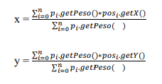

# Zattera 🚢
-- -
#### ☑️ Qua è presente la soluzione dell'esercizio Zattera
-- -
## Traccia:
Data la classe **Punto** che permette di identificare un punto nel piano. Realizzare:
1. La classe **Pacco** che:
   * Ha un attributo `peso` di tipo double;
   * Viene costruita passando il valore del peso dell’oggetto da creare (se il valore passato è minore o uguale a zero viene sollevata una IllegalArgumentException);
   * Mette a disposizione il metodo `getPeso()` che restituisce il peso del pacco.
2. La classe **ZatteraGalleggiante** che:
   * Ha una `altezza` e `larghezza` che vengono istanziati da un costruttore che prende due come parametri i due valori (se minori o uguali a zero viene sollevata una IllegalArgumentException);
   * Contiene al più 100 pacchi;
   * A ogni pacco viene associata una posizione;
   * Offre il metodo `aggiungiPacco(Pacco pacco, Punto posizione)` che aggiunge un pacco alla zattera nel punto indicato e che solleva una IllegalArgumentException se: il pacco o la posizione sono null, se la posizione è fuori dalle dimensioni della zattera, se la zattera è piena;
   * Offre il metodo `getPesoTotale()` che ritorna il peso di tutti i pacchi sulla zattera;
   * Offre il metodo `getPesoMedio()` che ritorna il peso medio dei pacchi sulla zattera;
   * Offre il metodo `getBaricentro()` restituisce il Punto le cui coordinate (x, y) corrispondente al baricentro dei pacchi. Se p1…, pn sono i pacchi posizionati nei punti pos1,…, posn, il valore `i` delle coordinate del baricentro sono calcolate come:

>**Non modificare la classe Punto e Main. Scaricare le due classi**
>**Non è consentito l'uso di classi della libreria standard di Java diverse da String, Math e dalle classi che rappresentano eccezioni. In particolare, non è consentito
>l’uso di alcuna classe contenitore (es. ArrayList, Vector, ecc.)**
>
>È fornita la classe **Main** che esegue alcuni test per verificare le principali
>funzionalità delle classi **XX** e **XX**